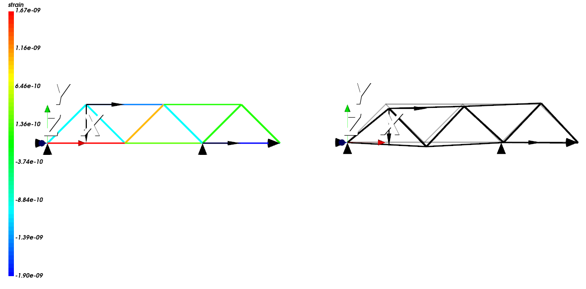

# fem2d: 2D Finite Element Method Solver

## Описание

**fem2d** — это программа для решения задач методом конечных элементов (МКЭ) в двухмерном пространстве, предназначенная для анализа напряженно-деформированного состояния конструкций, состоящих из стержневых элементов (ферм). Программа позволяет вычислять перемещения узлов, напряжения и деформации в стержневых элементах, а также визуализировать результаты с помощью VTK.

## Основные Возможности

- **Анализ ферм:** Вычисление перемещений узлов, напряжений и деформаций.
- **Конфигурация через файл:** Гибкая настройка модели через текстовый конфигурационный файл.
- **Визуализация:** Отображение деформированной геометрии, распределения напряжений и деформаций.
- **Модульная архитектура:** Легкость в обслуживании и расширении функциональности.

## Структура Проекта

Проект состоит из следующих основных частей:
- **solver:** Формирование матрицы жесткости и вектора сила, решение СЛАУ
- **preprocessor:** Обработка конфигурационного файла и создание модели.
- **postprocessor:** Визуализация результатов.

## Дополнительная информация

- **Подробная документация** находится в папке [`docs`](docs).
- **Примеры конфигурационных файлов и моделей** можно найти в папке [`examples`](examples).

## Пример

