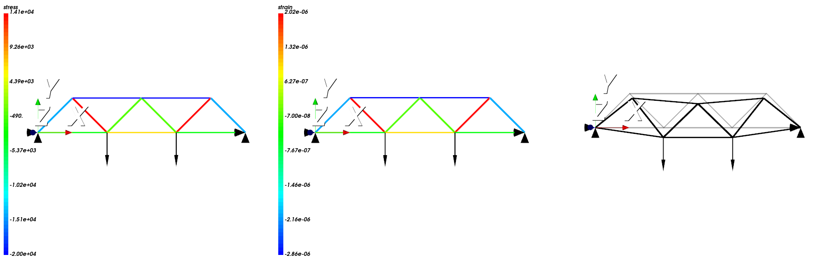

Ниже приведен пример входного файла и результат работы программы:

```
ETYPE,TRUSS

MATERIAL,7000000000,0.3,2800,1

SECTION,0.1

NODE,1,0,0
NODE,2,1,1
NODE,3,2,0
NODE,4,3,1
NODE,5,4,0
NODE,6,5,1
NODE,7,6,0

ELEM,1,2,1
ELEM,2,3,1
ELEM,1,3,1
ELEM,2,4,1
ELEM,3,4,1
ELEM,3,5,1
ELEM,4,5,1
ELEM,4,6,1
ELEM,5,6,1
ELEM,5,7,1
ELEM,6,7,1

FORCE,3,0,-1000
FORCE,5,0,-1000

DISP,1,0,0
DISP,7,0,0
```


Визуализация распределения напряжения, деформации и сравнение деформированного состояния с первоначальным:



Важно отметить, что для визаулизации деформированного состояния узлы умножены на некоторый масштабный коэффициент